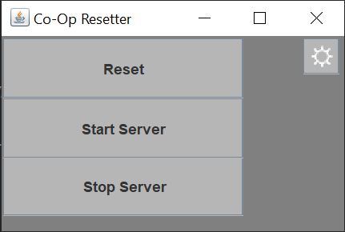

# Minecraft Co-Op Speedrun Resetter
## User Manual
To use, first download the program from [here](https://github.com/ilhs2011756/Final-Project/releases/latest)  
Then, you also need to set up a Minecraft server on your computer. You can find instructions on that [here](https://www.hp.com/us-en/shop/tech-takes/how-to-make-minecraft-server)  
Put the jar you downloaded from the first step in the same folder as your Minecraft server. Then, double-click the jar to run it. You should see this screen:  
  
Click the settings icon to configure it.

* "World" is the name of your world folder
* "Server Jar" is the name of the jar you use to run the server
* "Use Seed" is to choose whether you want to use a set seed
* "Seed" is the specific seed you want to use, if "Use Seed" is set to true
* "Min. Ram" is the minimum RAM you want allocated to the server
* "Max. Ram" is the max RAM that you want allocated to the server  

Then, click "Done" to save your settings  
To start, you can click the "Reset" button which deletes the existing world, and restarts the server  
From there, you can use the "Reset", "Start Server", and "Stop Server" buttons as you which.
* The stop server button also deletes the world folder, so just keep that in mind  

## Developer Guide
Overview:
* `Resetter.java`:
  * The main class for this program, has the `main()`, `reset()`, `stopServer()`, and `startServer()` methods
    * `main()` runs all the startup code, like initializing the config and the GUI
    * `reset()` just runs `stopServer()`, then `startServer()`
    * `stopserver()` kills the server process, then deletes the world
    * `startServer()` simply starts the server with the configured amount of RAM
* `Config.java`:
  * The class that manages everything to do with the config. Contains 2 constructors, and the `save()` and `load()` methods
    * One constructor takes no parameters, and initializes the config with default options
    * The other is for custom settings, and initializes the config with the specified values
    * `save()` saves the config options to the `config.json` file
    * `load()` loads them from the `config.json` file
* `ConfigAdapter.java`:
  * Extends the `TypeAdapter` class from the GSON library, overrides the `write()` and `read()` methods
    * `write()` is what parses the data into JSON
    * `read()` is what parses the JSON into the `Config` fields
* `GUI.java`:
  * Creates the main GUI, has a constructor and `toggleSettings()` method
    * The constructor simply creates the `JFrame` and adds all the different components to it
    * `toggleSettings()` is a simple method to easily toggle the visibility of the settings menu
* `SettingsScreen.java`:
  * Is responsible for creating and adding components to the settings menu. Contains a constructor and the `close()` method
    * The constructor creates the `JFrame` and adds all the components to it
    * `close()` saves the settings in case they were changed, and then disables the visibility of the settings menu  

## Bugs
I only know of one bug with this program so far, being that disabling the "Use Seed" option does not make the `level-seed` property in `server.properties` empty, and I cannot for the life of me figure out why  
Please report any other issues to me :)